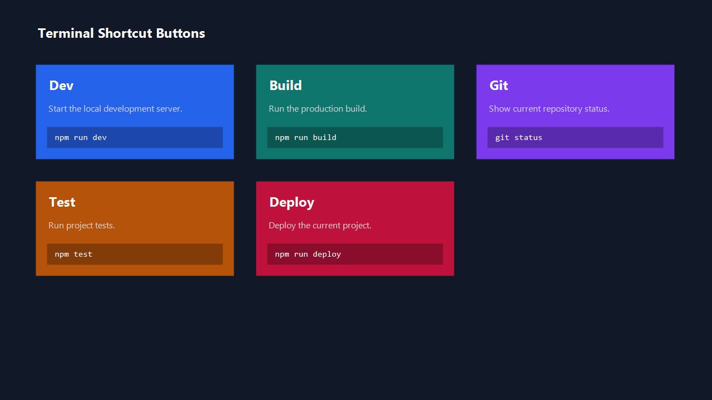
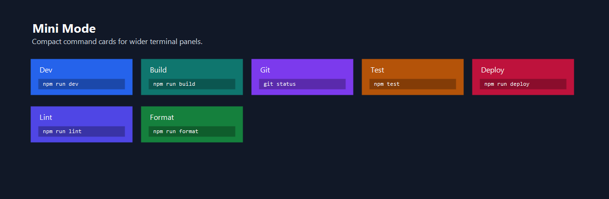

# Terminal Shortcut Buttons

[](https://open-vsx.org/extension/nemokoala/terminal-shortcut-buttons)
[](LICENSE)

Run your common terminal commands from configurable buttons in Cursor or VS Code.



## Install

Install from Open VSX:

[Terminal Shortcut Buttons on Open VSX](https://open-vsx.org/extension/nemokoala/terminal-shortcut-buttons)

In compatible editors such as Cursor, search for `Terminal Shortcut Buttons` in the Extensions view.

## Features

- Add shortcut buttons for commands like `npm run dev`, `npm run build`, `git status`, or custom scripts.
- Use a styled `Command Deck` panel with responsive cards.
- Switch between full-size and mini cards.
- Keep optional compact buttons in the bottom status bar.
- Reuse a named terminal or create a fresh terminal per command.
- Configure button labels, commands, descriptions, colors, icons, and ordering from `settings.json`.

## Command Deck

Open the `Terminal Buttons` icon in the Activity Bar to use the Command Deck.

The deck automatically lays buttons out in multiple columns when the panel is wide enough. Use `Mini Mode` to reduce card height and fit more commands on screen.



## Example Configuration

Add this to your workspace `.vscode/settings.json`:

```json
{
  "terminalButtons.showStatusBarButtons": true,
  "terminalButtons.compactDeck": false,
  "terminalButtons.commands": [
    {
      "label": "Dev",
      "icon": "terminal",
      "command": "npm run dev",
      "terminalName": "Dev Server",
      "reuseTerminal": true,
      "description": "Start the local development server.",
      "statusBarColor": "#ffffff",
      "statusBarBackgroundColor": "prominent"
    },
    {
      "label": "Build",
      "icon": "gear",
      "command": "npm run build",
      "terminalName": "Build",
      "reuseTerminal": false,
      "description": "Run the production build."
    },
    {
      "label": "Git",
      "icon": "source-control",
      "command": "git status",
      "terminalName": "Git",
      "reuseTerminal": true,
      "description": "Show current repository status."
    }
  ]
}
```

Colors are assigned automatically when `backgroundColor` and `color` are omitted. You can override them per button:

```json
{
  "label": "Deploy",
  "command": "npm run deploy",
  "description": "Deploy the current project.",
  "backgroundColor": "#dc2626",
  "color": "#ffffff"
}
```

## Workspace vs User Settings

`terminalButtons.commands` can live in both user settings and workspace settings.

Terminal Shortcut Buttons reads both lists and shows them together:

- `Project Commands` from the current workspace `settings.json`
- `Global Commands` from your global user `settings.json`

Project commands are shown first, followed by global commands. This applies to both the Command Deck and the optional bottom status bar buttons.

Use workspace settings for project-specific command lists:

```json
{
  "terminalButtons.commands": [
    {
      "label": "Dev",
      "command": "npm run dev"
    },
    {
      "label": "Build",
      "command": "npm run build"
    }
  ]
}
```

Use user settings for UI preferences you want everywhere:

```json
{
  "terminalButtons.showStatusBarButtons": true,
  "terminalButtons.compactDeck": true
}
```

Cursor and VS Code merge settings using their normal priority rules. Workspace settings override user settings for the current project.

For `terminalButtons.commands`, this extension reads both scopes directly so project and user command lists can appear at the same time.

The `Edit Project` button opens the current workspace `.vscode/settings.json` file directly. If the `.vscode` folder, `settings.json`, or `terminalButtons.commands` entry is missing, it creates the missing pieces and adds a starter command list.

The `Edit Global` button opens your global user `settings.json`. If `terminalButtons.commands` is missing, it creates a starter list there too.

## Settings

| Setting | Type | Default | Description |
| --- | --- | --- | --- |
| `terminalButtons.commands` | array | sample commands | Button definitions. |
| `terminalButtons.showStatusBarButtons` | boolean | `true` | Show shortcut buttons in the bottom status bar. |
| `terminalButtons.compactDeck` | boolean | `false` | Use shorter cards in the Command Deck. |

## Button Options

| Option | Type | Description |
| --- | --- | --- |
| `label` | string | Button label. |
| `command` | string | Terminal command to run. |
| `description` | string | Secondary text shown in the Command Deck. |
| `icon` | string | Optional Codicon name for the status bar button. |
| `terminalName` | string | Terminal name. Defaults to the label. |
| `reuseTerminal` | boolean | Reuse the same named terminal when possible. |
| `backgroundColor` | string | Optional CSS color for the Command Deck card. |
| `color` | string | Optional CSS text color for the Command Deck card. |
| `statusBarColor` | string | Optional foreground color for the status bar button. Defaults to `color` when omitted. |
| `statusBarBackgroundColor` | string | Optional status bar background style: `prominent`, `warning`, `error`, or `none`. |
| `alignment` | string | Status bar alignment: `left` or `right`. |
| `priority` | number | Status bar priority. |

## Commands

- `Terminal Buttons: Refresh Buttons`
- `Terminal Buttons: Edit Project Command List`
- `Terminal Buttons: Edit Global Command List`
- `Terminal Buttons: Toggle Command Deck Size`
- `Terminal Buttons: Create Workspace Settings`

## Development

Open this folder in Cursor or VS Code and press `F5` to launch an Extension Development Host.

## Package and Publish to Open VSX

```powershell
cd C:\dev\cursor-terminal-buttons
npx ovsx create-namespace nemokoala -p <OPEN_VSX_TOKEN>
npx ovsx publish -p <OPEN_VSX_TOKEN>
```

The published extension ID will be:

```text
nemokoala.terminal-shortcut-buttons
```
